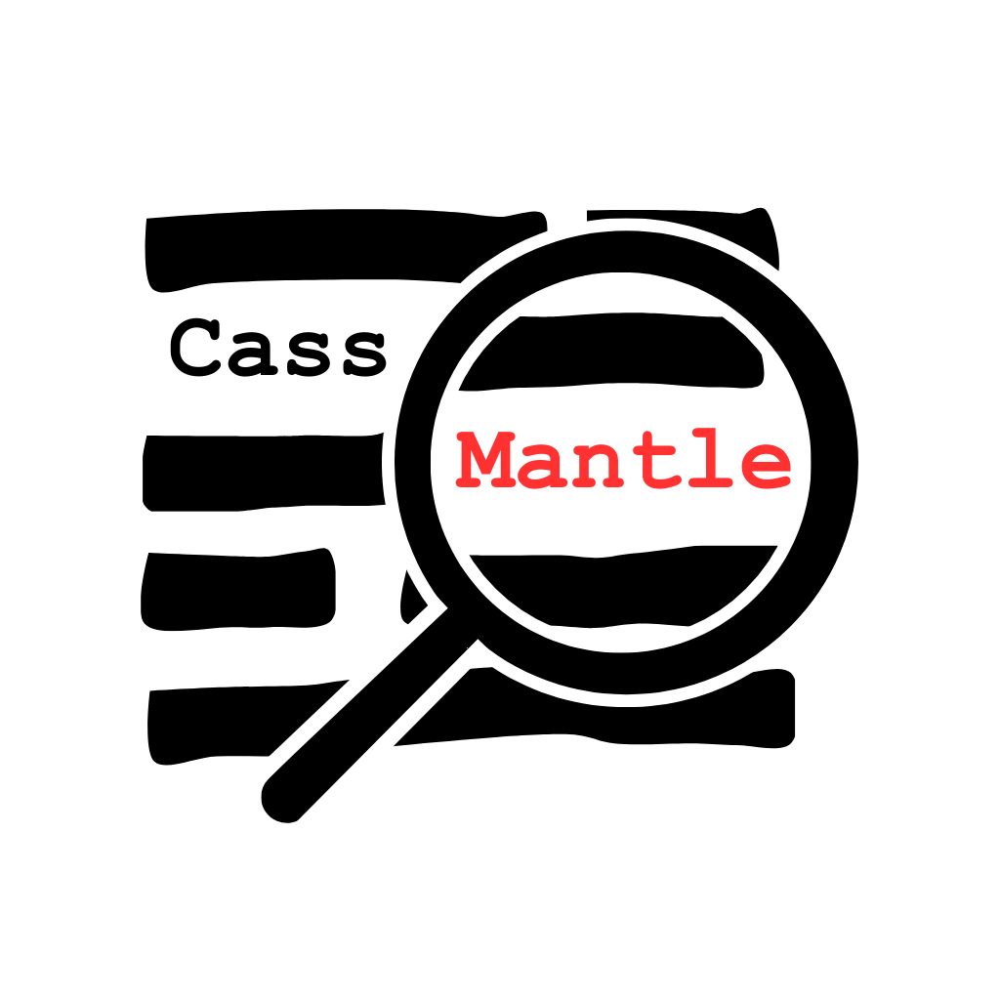
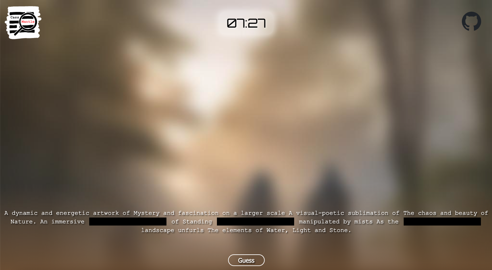

# CassMantle

## Introduction

Inspired by **[pimantle](https://semantle.pimanrul.es/)**, but with images and powered by a ton of AI! You are required to guess the missing parts of the prompt (semi-randomly generated by a language model) given a blurred image (generated from the previously generated prompt with a diffusion model). The closer your guesses are to the actual answers, the less blurry the image gets! Prompts and images update every 15 minutes (as of now).

