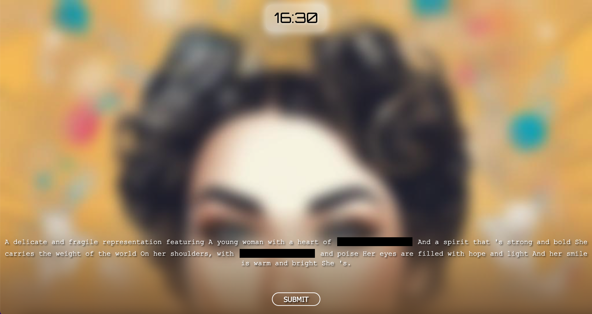

# Imentle

Inspired by **[pimentle](https://semantle.pimanrul.es/)**, but with images and powered by a ton of AI! You are required to guess the missing parts of the prompt (semi-randomly generated by a language model) given a blurred image (generated from the previously generated prompt with a diffusion model). The closer your guesses are to the actual answers, the less blurry the image gets! Prompts and images update every 20 minutes (as of now).

# How it works

Imentle consists of 3 main components:

## 1. API Server

The API server includes logics to handle communications directly with clients. It processes requests from the client and offloads necessary computations to the other 2 microservices via **RabbitMQ**.

## 2. Prompt Service

The prompt service handles the natural language tasks required by the project. It consists of two main components: a **Word2Vec** model used for word vectorization to compute numeric similarities between words; a **Large Language Model** used for prompt generation. The prompt service listens on a declared queue in RabbitMQ, any requests to the service are processed and the results stored in **Redis**.

## 3. Diffuser Service

The diffuser service consists of a stable diffusion model that is used to perform text-to-image generation tasks. Similar to the prompt service, the diffuser service communicates to the API server via RabbitMQ and stores its results in Redis.