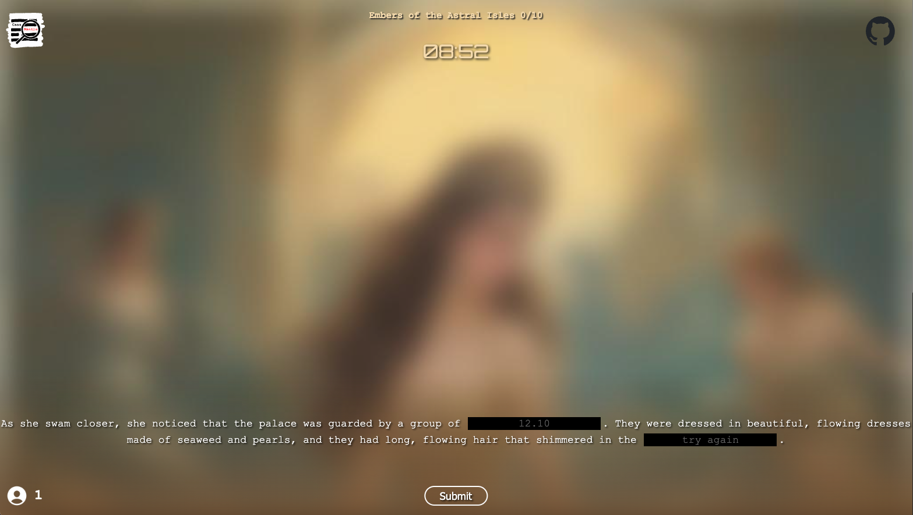

# CassMantle

## Introduction

**[Play here](https://cassmantle.com/)**! Inspired by **[pimantle](https://semantle.pimanrul.es/)**, but with images (potentially soundtracks) and powered by a ton of AI! 

You are required to guess the missing parts of the prompt (semi-randomly generated by a language model) given a blurred image (generated from the previously generated prompt with a diffusion model). The closer your guesses are to the actual answers, the less blurry the image gets! Prompts and images update every 15 minutes (as of now).

The prompts are generated in sequential fashion. A seed prompt (story name) is used to generate the first prompt, all episodes after will use the previous prompt as its seed prompt, until the maximum number of episodes are reached.

